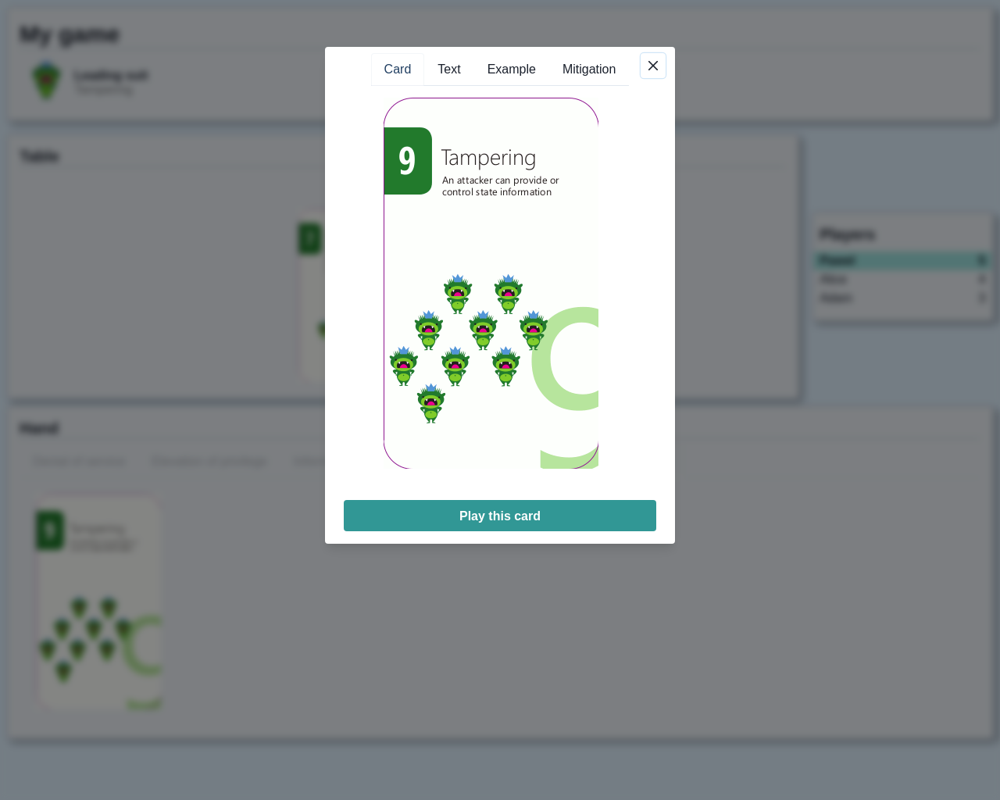
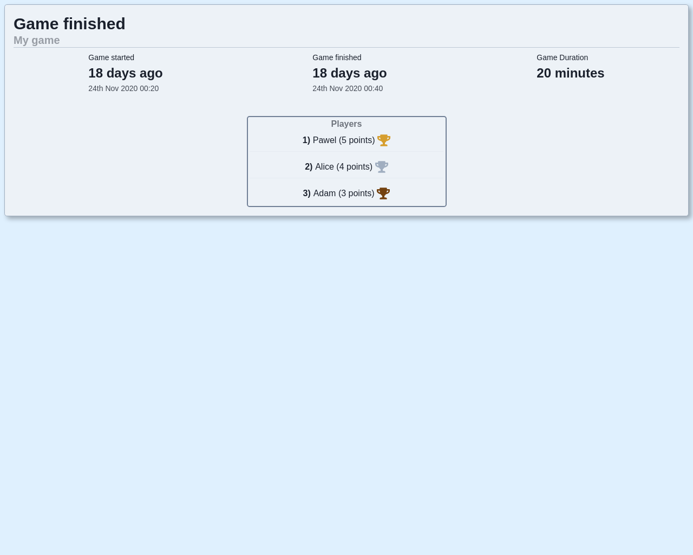

# Elevation of Privilege (online edition)

**Elevation of Privilege** is a card game used during a threat modeling session. It was designed by Adam Shostack at Microsoft. More details about the game itself, and the cards ready to print can be found [here](https://www.microsoft.com/en-us/download/details.aspx?id=20303) and [here](https://github.com/adamshostack/eop).

This application was created to allow people working far away from each other (either because of remote work or participation in open source projects) to replace physical cards with a web browser.

The game is available online at https://eop-prod-eop-ave5t2.mo1.mogenius.io](https://eop-prod-eop-ave5t2.mo1.mogenius.io)

##### Custom descriptions
Since some descriptions on the cards seemed unclear, I decided to add additional tabs (**example** and **mitigation**) that will make it easier to link the threat related to card with the analyzed system.

It seems that the game was originally designed (at least partially) for threats related to desktop applications. By creating examples I tried to adapt them to the problems of web applications (of course some problems remain universal).

**Currently, game data is deleted 90 days after the start or end of the play.**

**Disclaimer**: _the license does not cover card files and images that have been made available by Microsoft under the [Creative Commons Attribution 3.0](http://creativecommons.org/licenses/by/3.0/us/) license (see Details section [here](https://www.microsoft.com/en-us/download/details.aspx?id=20303))._

### Run locally (Docker image)

The application requires a Postgres database to run.

`docker run --rm --name eop_online -p 8181:8181 -e SECRET_KEY=fooBar -e "DB_URL=jdbc:postgresql://dbhost:5432/eop" -e DB_USER=eop -e DB_PASSWORD=secret paweljpl/eop-online`

##### Environment variables:

| Variable             | Required | Default value | Description |
| -------------------- |:--------:|:-------------:| -----------:|
| **PORT**             | no       | 8181          | Http port on which the application will listen                       |
| **SECRET_KEY**       | yes      |               | Secret key used to sign JWT tokens (should be long and random)       |
| **DB_URL**           | yes      |               | JDBC connection URL                                                  |
| **DB_USER**          | yes      |               | Database user name                                                   |
| **DB_PASSWORD**      | yes      |               | Database use password                                                |
| **DB_MAX_POOL_SIZE** | no       | 3             | maximum number of connections to the database in the connection pool |
| **GAME_CLEAN_EVERY** | no       | 10 minutes    | How often should the task of cleaning outdated games be started      |
| **GAME_VALID_FOR**   | no       | 90 days       | after which time the game can be considered outdated                 |

### Game screens

##### Create game

##### Game overview

##### Play the card

##### Game finished

